# PICO-MIDI-Cheesebox
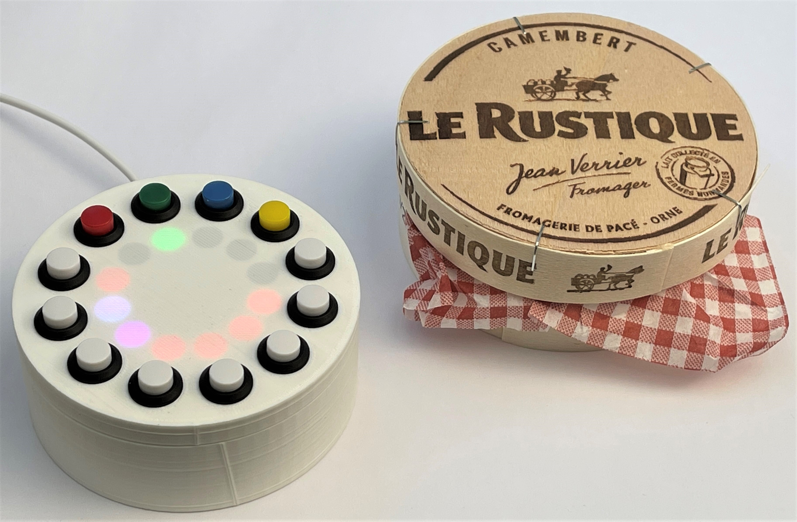
Designs and software for a MIDI controller described in issue 48 of Hackspace magazine and issue 113 of MagPi magazine.
## Videos
[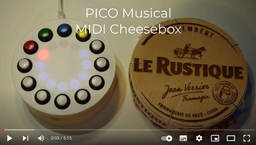](https://youtu.be/ojN6h7QUoZ8)

To find out more about the device click on the image above to see a short video.

[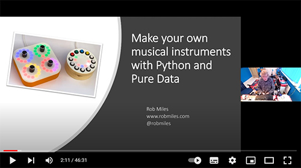](https://youtu.be/zAFZJPzWo54)

This video describes the cheesebox and how it works, along with the Crackers Controller and Pure Data. It was delivered at the [DDD conference in November 2021](https://www.youtube.com/channel/UCJH7bvJ_zCX4VDWGg16e20w)
## Building the device
The parts you'll need are as follows:

* A Raspberry Pi PICO
* A 12 pixel WS2812 pixel ring (search for " WS2812 ring 12") 
* 12 coloured push buttons. Ideally 8 white buttons for the notes and a red, green, blue and yellow button for the controls. The buttons should be non-locking, push to make.
* A micro-USB cable to link the PICO to the host
* Connecting wire. I used coloured wire wrap (search for "30 AWG wire wrap") which needed a wire wrap tool (search for "wire wrap tool"). I also used a fair amount of heat shrink tubing.
* A Raspberry Pi or machine running Windows, MacOS or Linux running PureData to make the sounds.
* A box. There is a 3D printable design, or you can just drill some holes for the lights and buttons in a cheese box and stick the pixel ring and PICO inside it.
* Screws. You'll need some screws side M2 4mm in length to fix the pixel ring and PICO to the case (search for "laptop screws").

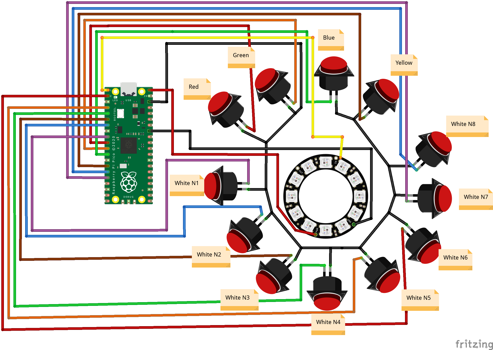

Each button is assigned its own pin on the PICO. If you use the connections show above you can use the software as supplied. If you use different connections you'll need to modify the code.
```
notes = (
    Note(pin=board.GP6,pixel=11,num=0),
    Note(pin=board.GP5,pixel=10,num=1),
    Note(pin=board.GP4,pixel=9,num=2),
    Note(pin=board.GP3,pixel=8,num=3),
    Note(pin=board.GP2,pixel=7,num=4),
    Note(pin=board.GP1,pixel=6,num=5),
    Note(pin=board.GP12,pixel=5,num=6),
    Note(pin=board.GP11,pixel=4,num=7)
    )

selects = (
    Select(pin=board.GP7,pixel=0,col=Col.RED),
    Select(pin=board.GP8,pixel=1,col=Col.GREEN),
    Select(pin=board.GP9,pixel=2,col=Col.BLUE),
    Select(pin=board.GP10,pixel=3,col=Col.YELLOW)
            )
```
These are the pin assignments in the software. You can use this code to tell you what connections to make when you are building the device. This code can be found in the source file code.py in the python folder in this repository. 
## Making a box
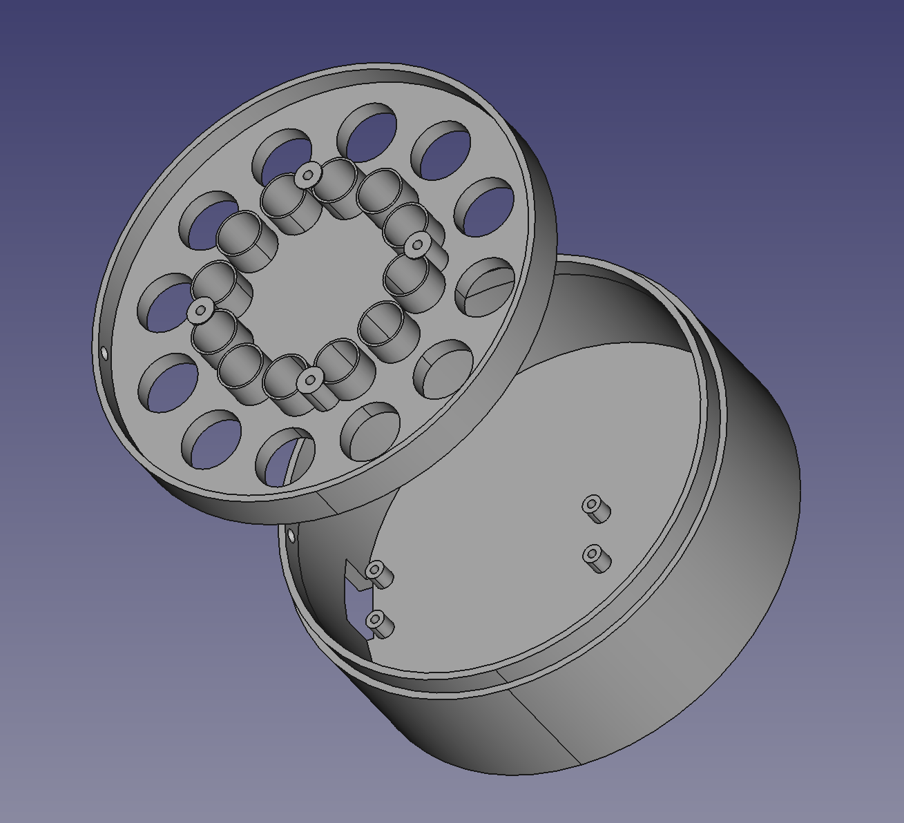
There are 3D printable case designs in the case folder in the repository.
## Installing the software
The software as supplied uses Circuit Python Version 6. You can find the uf2 Python image and a lib folder to copy onto your device in the python folder in this repository. To configure a device do the following:

1. Hold down the Bootsel button on your Pico. 

2. Plug the Pico into your PC. It will connect to your PC as a storage device. 

3. Drag the file adafruit-circuitpython-raspberry_pi_pico-en_GB-6.3.0.uf2 from the python folder in this repository onto the PICO storage device. Once the file has been copied the PICO will reboot as another storage device which contains the Circuit Python system. 
4. Copy the contents of the python/lib folder in this repository into the lib folder on the PICO device. 
5. Copy the file code.py from the python folder into the PICO at the top level (i.e. alongside the wifi and wifi_log files). This program will run when the MIDI Cheesebox is powered on.

When you power up your cheesebox you will see that the led next to the red button is lit red and the leds next to the eight white buttons are lit white. 
## Connecting a CheeseBox to Pure Data using MIDI
You can use the PICO MIDI CheeseBox with any MIDI device. If you want to use it with Pure Data you can do the following:  

Start by plugging your CheeseBox into your computer. You must do this before you start Pure Data. Now start Pure Data running and open the MIDI preferences dialogue using the menu **File>Preferences>MIDI** option shown below. 

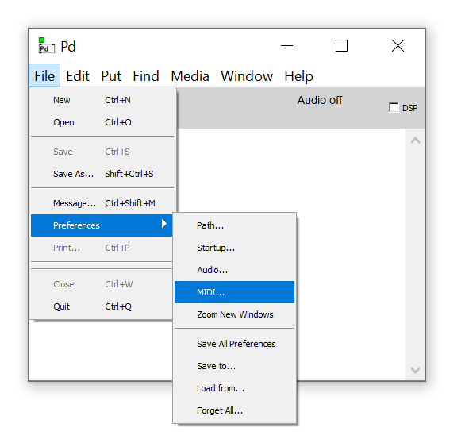

The MIDI dialogue is where you configure connections to MIDI devices being used by Pure Data. We can map one device for MIDI input and one for output. If you want to use multiple devices you can click the **Use Multiple Devices** button. 

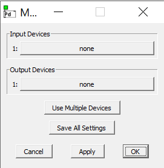

We only want to assign the CheeseBox as an input, so click the **none** button against input device number 1. Pure Data will now show you all the MIDI input devices connected to your computer and invite you to select one:

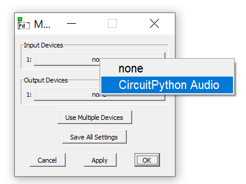

Click **CircuitPython Audio** to select it 

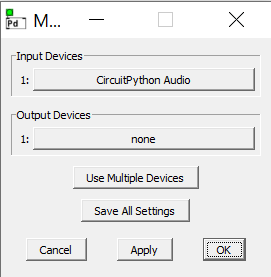

Now click **OK** to apply the settings and save them. If you don't have a CircuitPython Audio device to select you should make sure that the CheeseBox is properly connected and is running the CircuitPython program.

You can test the MIDI connection by opening a test patch built into the Pure Data environment. Select this using the **Media>Test Audio and MIDI..** option in the Pure Data application.

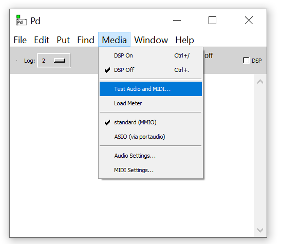

This is a very useful test feature. You might also find that just opening the test patch will make your MIDI device start to work properly. 


This patch will show incoming MIDI and audio signals. 

## The CheeseBox Pure Data Patch

The CheeseBox can be used with the CheeseBox Pure Data patch to make sounds on your device. Load this by opening the **File>Open** dialog in Pure Data.

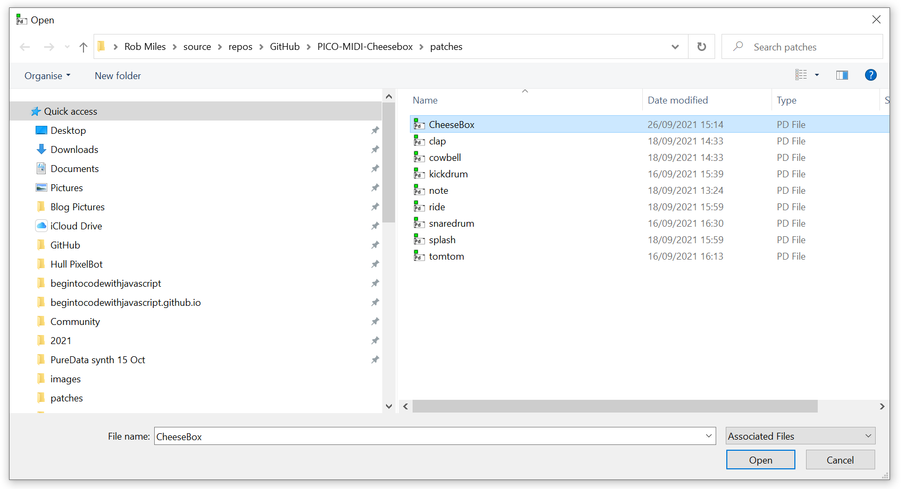

Navigate to the folder on you machine that contains the patches for this applicatiuon and select the CheeseBox patch and click **Open** to open it. The patch will load and start running automatically. Note that this patch can run at the same time as other patches. The other patch files in the folder are used by the CheeseBox patch. 
## Controlling the CheeseBox

The Cheesebox is controlled by 12 push buttons around the outside of a ring of 12 leds. The bottom 8 buttons are white and are used to play musical notes and enter rhythm steps. The top four coloured buttons are used to select the currently active track. 

The red track is used for playing tunes. When the red track is active (indicated by the led underneath the red button being red) you can play musical notes on the white buttons. When you are playing tunes the controller will send a MIDI note on message when a white button is pressed and a note off message when the button is released. You can configure tune playback by pressing and holding the red button when in music playback mode. The cheesebox will display 7 settings values using the coloured pixels for the notes. You can then step through a particular setting by pressing the corresponding white button. 

---
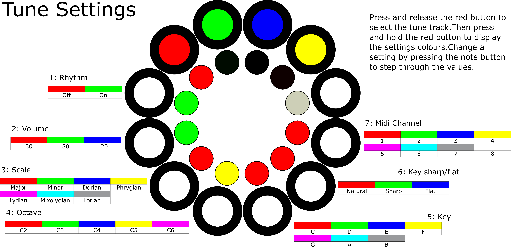
Each setting value is indicated by the colour of the corresponding pixel. 
### 1: Rhythm
This setting can be toggled between on and off (green and red). When this setting is off all the rhythm tracks are stopped. You can use this to stop rhythm playback and also to synchronise the start of all the rhythm tracks. By default (i.e. when the CheeseBox is powered on) the rhythms are all on. 
### 2: Volume
This setting determines the MIDI velocity value of notes that are played by the CheeseBox. There are three different volume levels, 30, 80 and 120. By default the volume level is 80.
### 3: Scale
The eight white notes are mapped onto a musical scale. You can use this setting to determine the scale that is used. This affects the intervals between successive notes. You can change the "sound" of a piece by switching to a different scale. By default the CheeseBox uses a major scale. 
### 4: Octave 
The CheeseBox allows you to change the octave used for the 8 notes that are played, from C2 (low bass) to C6 (high piano). The default octave is C5.
### 5: Key
The notes that are played by the CheeseBox can be mapped into any one of 8 keys. By default the key is that of C.
### 6: Sharp/Flat
This setting determines whether the selected key starts on a sharp, a flat or a natural. By default the key is natural.
### 7: MIDI Channel
This setting is used to select the MIDI channel which will be used when note values are transmitted by the CheeseBox. By default the CheeseBox will send notes on MIDI channel 1. 

Tracks that are selected by the green, blue and yellow buttons are rhythm tracks. You can use these to record sequences of up to 32 rhythm or music steps. The output from a track can be sent as a note or rhythm value or the note value can be combined with other track note values to create "Euclidean" note sequences. When a rhythm track is running a white cursor pixel will move around the eight notes. A track can contain up to four "bars". A "bar counter" in the colour of the active track is displayed on the top four pixels. You can enter steps by pressing the white button of the corresponding step to move through the note options:

The settings for the rhythm tracks are managed in the same way as the tune track. Hold down the selction button for the active colour and then use the note buttons to step through the drum options:

---

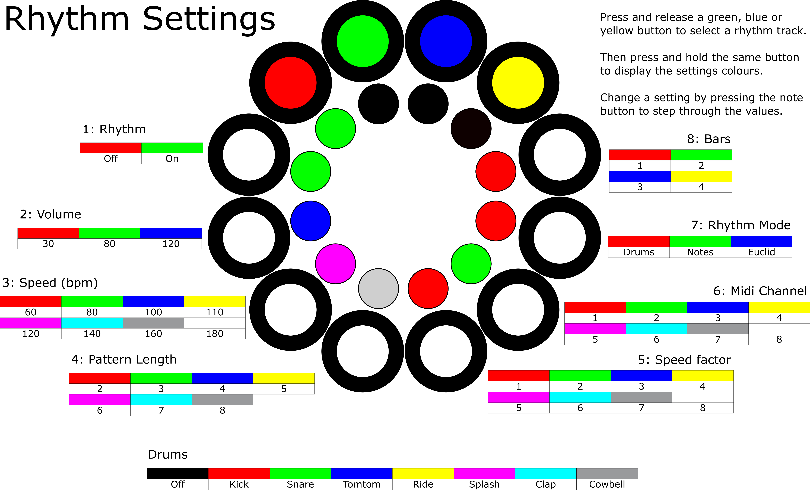

### 1: Rhythm
This setting can be toggled between on or off. When the setting is off the track is stopped.
### 2: Volume
This setting determines the MIDI velocity value of rhythm sounds that are played by the CheeseBox. There are three different volume levels, 30, 80 and 120. By default the volume level is 120.
### 3: Speed (bpm)
This setting determines the speed in beats per minute of the track. The values available are 60,80,100,110,120,140, 160 and 180 bpm. The default is 120 bpm.
### 4: Pattern length
This setting determins the length of the pattern for this rhythm track. If you only want two drum sounds on the track you can set a length of two and only set the first two steps. You can set a length between 2 and 8. Note that if you select a number of bars the pattern size sets the size of the last bar. This means that if you want a pattern that lasts 14 steps you would set the pattern length to 4 and the bars to 2. The first bar would have 8 steps in it and the second 4, making a total of 12. The default track length is 8 steps. 
### 5: Speed factor
You can slow a track down by setting the speed factor value. A speed factor of 1 (the default) will play a step for every beat. A speed factor of 2 would play a step every two beats, and so on up to a maximum speed factor of 8, which would play a step every 8 beats. You can use this to create very slow, long-running patterns. 
### 6: MIDI channel
This setting is used to select the MIDI channel which will be used when steps are transmitted by the CheeseBox. By default the CheeseBox will send steps on MIDI channel 2 for the green track, 3 for the blue track and 4 for the yellow track. If you want a track to send notes to the same channel as the keyboard (red track) you can set the MIDI channel for the notes to 1. 
### 7: Rhythm mode
This setting determines how the rhythm steps work. There are three different modes:
- rhythm
- notes
- Euclidian

In rhythm mode each of the steps contains one of eight rhythm sounds. The colour of the pixel in that step indicates the sound that will be produced.

---

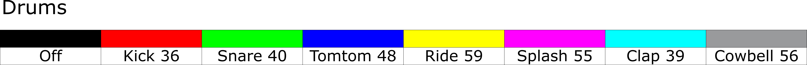

If a step is unlit no sound is produced for that step.

In note mode mode each step produces a musical note in the same key and scale as the main keyboard. This can be used to play automated sequences of notes. 

In Euclidean mode the Cheesebox calculates a note number by adding up all the note values at the current position for all the tracks set as Euclidean. The total value of all the notes is then used to index the current scale to generate a note value to be played. It is great fun to set all the tracks to Euclidean running at different speeds and then enter a few notes. You get some interesting evolving sounds. 
### 8: Bars
This setting determines the length of the sequence. By default it is set at 1, which means that the sequence is repeated across the lights. Adding more bars increases the length of the sequence in pages of 8 steps. The four coloured lights above the notes display show the current bar number as a sequence is played. If you set a pattern length value (see setting 4) this determines the length of the final bar of the sequence. By using a combination of bar count and pattern length you can create sequences of 2-32 steps.
## Pure Data
The patches for the sound generator are in the patches folder. Copy the entire folder onto your computer and then open the CheeseBox patch. The other files are used by this patch.

Have fun

Rob Miles